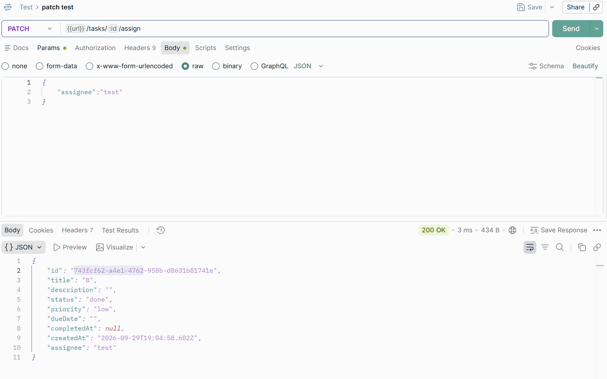
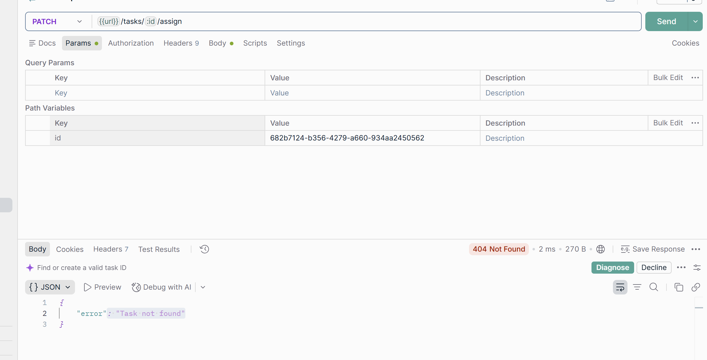

# Task Assignment API

## Endpoint

**PATCH `/tasks/:id/assign`**

Assigns a task to a user by storing the provided assignee name on the task.

### Request

```json
{
  "assignee": "John"
}
```

---

## Successful Assignment

When a valid task ID and assignee are provided, the API assigns the task and returns the updated task.

**Status:** `200 OK`

### Example Response

```json
{
  "id": "task-id",
  "title": "Complete assignment",
  "assignee": "John"
}
```

### Screenshot



---

## Validation

The API validates the `assignee` field.

The following inputs are rejected:

* Missing `assignee`
* Empty string
* Whitespace-only string

**Status:** `400 Bad Request`

---

## Task Not Found

If the provided task ID does not exist, the API returns:

**Status:** `404 Not Found`

### Response

```json
{
  "error": "Task not found"
}
```

### Screenshot



---

## Reassignment

If a task is already assigned, it can be assigned to another valid assignee.

This allows tasks to be reassigned when needed.

---

## Tests Added

The following cases are covered by tests:

* Successful task assignment
* Non-existent task returns `404`
* Missing assignee returns `400`
* Empty assignee returns `400`
* Whitespace-only assignee returns `400`
